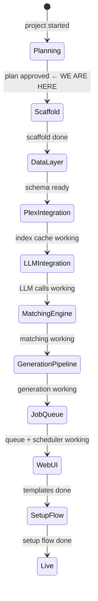
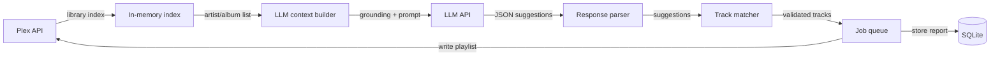

# State

> Last updated: 2026-03-17

## System State Diagram

## Component Status

| Component | Status | Notes |
|-----------|--------|-------|
| Dockerfile + docker-compose | ⏳ Not started | |
| requirements.txt + app skeleton | ⏳ Not started | |
| SQLite schema (db.py) | ⏳ Not started | 4 tables: playlists, generation_reports, refresh_log, config |
| Plex integration (plex.py) | ⏳ Not started | Library index cache, Sonic Analysis detection |
| LLM integration (llm.py) | ⏳ Not started | OpenAI-compatible, httpx, token estimation |
| Matching engine (matching.py) | ⏳ Not started | Normalise, exact, fuzzy (≥85%), artist fallback |
| Generation pipeline | ⏳ Not started | Batching, backfill, LLM response parsing |
| Job queue + scheduler | ⏳ Not started | asyncio.Queue, polling, debounce, integrity audit |
| Web UI templates | ⏳ Not started | 4 screens: setup, dashboard, detail, settings |
| SSE progress streaming | ⏳ Not started | |
| First-run setup flow | ⏳ Not started | Plex sign-in, LLM config validation |

## Data Flow

## Dependencies

| Dependency | Status | Notes |
|------------|--------|-------|
| Plex Media Server | Working (external) | Running on HP Microserver, port 32400 |
| LLM API (OpenAI-compatible) | Not configured | Configured at first-run setup |
| Docker | Assumed available | HP Microserver deployment target |
| PlexAPI Python library | Not installed | Goes in requirements.txt |
| rapidfuzz | Not installed | Fuzzy matching |
| aiosqlite | Not installed | Async SQLite |
